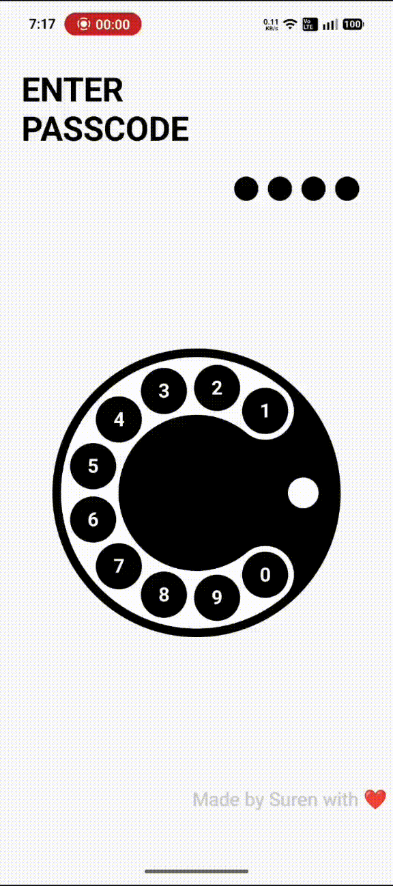

# 📞 Rotary Dialer (Jetpack Compose)

A nostalgic **rotary phone dialer** built using **Jetpack Compose**.
This project recreates the classic dial experience with smooth animations and gesture handling.

---

## 📱 Preview

> A modern take on the classic rotary phone dialer

  

---

## 🛠️ Built With

* Kotlin
* Jetpack Compose
* Canvas API
* Animations (Animatable, Tween, Spring)

---

## 🧠 How It Works

* The dial rotates based on **drag gestures**
* Angle calculations determine the selected digit
* On release, the dial:

    * Detects the digit at the reference point
    * Animates back to its original position
* Entered digits are displayed as a passcode

---

## 🙌 Credits

Inspired by a concept shared by **Shubham Singh**

---

## ❤️ Author

Made with ❤️ by **Suren**

---
